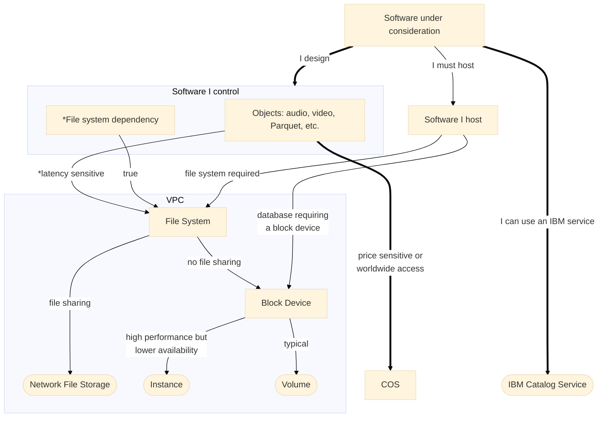

# IBM Storage
Companion to blog pos but not woven into the text so not called out in the blog post.



# k8s
## Dynamic provision
[Storing data on Block Storage for VPC](https://cloud.ibm.com/docs/containers?topic=containers-vpc-block)


[pvc_vpc_block.yaml](k8s/pvc_vpc_block.yaml)

```
kubectl apply -f pvc_deployment.yaml
kubectl get pods -o wide
```
## Dynamic provision problem
Dynamic provisioning of the PVC (and associated PV):
```
pv_name=$(kubectl get pvc/my-pvc --template={{.spec.volumeName}})
volume_id=$(kubectl get pv/$pv_name --template={{.spec.csi.volumeAttributes.volumeId}})
node_name=$(kubectl get nodes  -o json | jq -r '.items[]|select(.status.volumesInUse[0]=="kubernetes.io/csi/vpc.block.csi.ibm.io^'$volume_id'")|.metadata.name')
echo kubernetes.io/hostname: $node_name

kubectl label  node/$node_name pvc=my-pvc
```

## Static provision

instead of trying to determine which node it will get created on with dynamic provisioning… you could use the storage attachment create cli/api - https://test.cloud.ibm.com/docs/containers?topic=containers-kubernetes-service-cli#cs_storage_att_cr - to attach a volume to a specific node,


```
# cluster id
c=c7o5069d0t2jkhpch1i0
w=kube-c7o5069d0t2jkhpch1i0-ikscos00clu-default-00000170
w=kube-c7o5069d0t2jkhpch1i0-ikscos00clu-default-00000250

# create volume
ibmcloud volume-create k8s general-purpose us-south-1 --capacity 10
v=r006-0e3ecb7a-4b4e-436a-950c-22d582143446

# take a look at existing attachments
ibmcloud ks storage attachment ls --cluster $c --worker $w
# create attachemnt
ibmcloud ks storage attachment create --cluster $c --volume $v --worker $w
ibmcloud ks storage attachment ls --cluster $c --worker $w
```


then use static provisioning for the pv/pvc & then node selectors on your app pod.
you can use static provisioning like here - https://test.cloud.ibm.com/docs/containers?topic=containers-vpc-block#vpc-block-static - but i think this example will still only attach the volume to a worker in the zone you enter - not a specific worker node - whereas if you use the attachment create cli you can specify the worker as well as the zone…
so I think* it would be something like this -
attachment create - to attach a volume to a certain node/zone
statically provision the pv/pvc with volume details
use node selectors in your app pod.
i tried this in my cluster but i only have one node per zone so just using the pv would work in my case.
it might be possible to specify the node in the node selector terms of the PV - but i’m not sure if that is supported.

# OpenShift
See [README.md](./openshift/README.md)